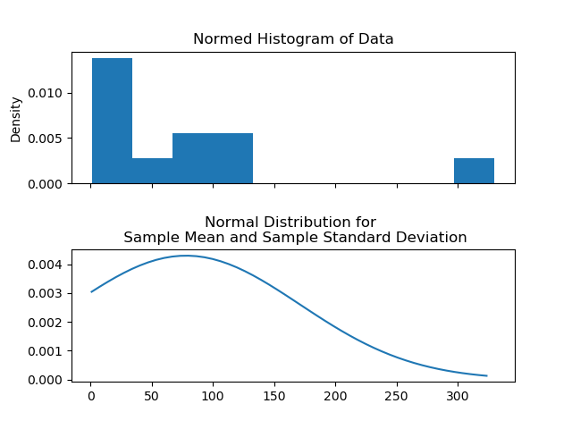

# [Statistical Distributions]


<!-- Function to add Histogram : Created by Priya: 13-04-21 -->

Prerequisites
-------------
Matplotlib is required to generate and view distribution graphs

```
pip install matplotlib

```
---
## Requirements:
The project uses the standard data science libraries.

```python libraries
import pandas;
import numpy;
import matplotlib.pyplot;
import seaborn as sns;
```
---
## Calculations:
```
**Variance** 
**Histogram**
**Median**
**Housing**    
**Gaussian**
**Probability Density function**
```

*Variance 
*Histogram
*Median
*Housing    
*Guassian

candy code will explain the distrubition accross all the brand
=======
---
## Sample Output:



[Statistical Distributions]: https://shiva-adith.github.io/statistical_distributions/

